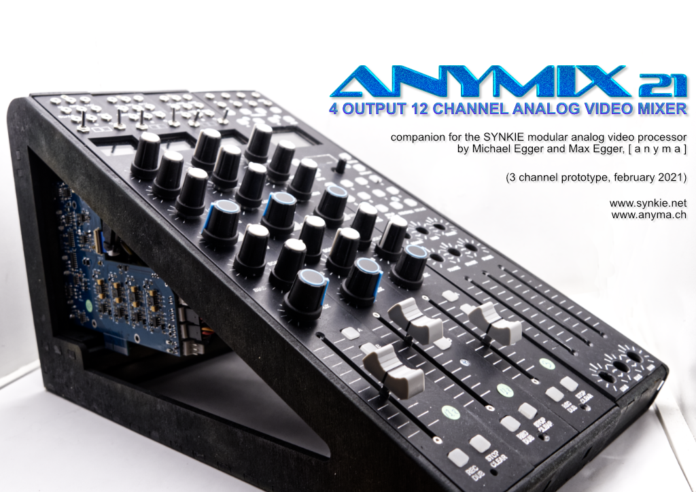
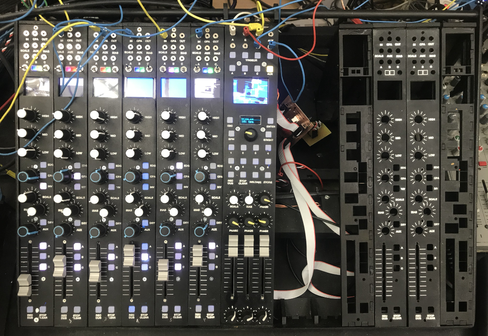

# ANYMIX 21

Multichannel modular analog PAL video mixer based on the SYNKIE project

The Anymix21 is a 12 channel analog video mixer based on the paradigm of classic audio mixing desks.

Each channel is a complete SYNKIE by itself, sort of. It can handle anything from DC to around 10Mhz, this means you can mix CV signals with audio with PAL composite video signals. Contrary to an audio mixer, inputs are DC coupled, with 0v being black and 0.7V white level. Negative levels are permitted but will be clipped at the final output stage.

Each channel has a built-in equaliser, switchable edges (bandpass), comparator and inverter effects, and a scale-bias module for adjusting brightness and contrast. The signal can then be routed to 3 main output mix busses and an auxiliary output.

Apart from the equalizer, the effects and mix levels are digitally controlled analog, so parameters can be recorded, automated, or controlled externally through MIDI. The desk can be synchronized to a MIDI clock (which is then quantized to the vertical blanking interval derived from the genlock input).

Still under construction, the first 6 channels have passed their endurance test running daily for weeks at the exhibiton “H.o.Me. – Heim für obsolete Medien” at Kunsthaus Langenthal.

### Documentation
- Architecture [Overview](./doc/architecture.md)
- Mixer Channel: [Flowchart and description](./doc/channel.md)
- Master Section: [Flowchart and description](./doc/master.md)

### Links
- [Build pictures and notes](https://www.anyma.ch/blogs/research/2021/04/07/building-the-anymix21/) on my blog
- [https://www.anyma.ch](https://www.anyma.ch)
- [https://www.synkie.net](https://www.synkie.net)
- [Videos on Vimeo](https://vimeo.com/showcase/8252873)
- [Synkie on Github](https://github.com/mirdej/synkie)