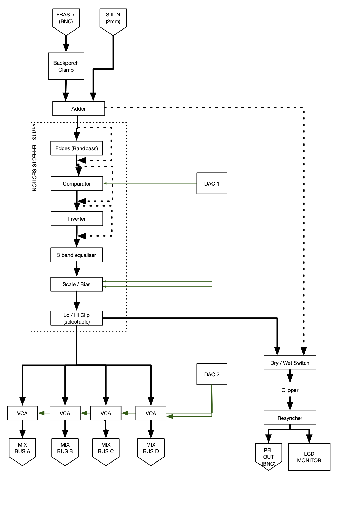
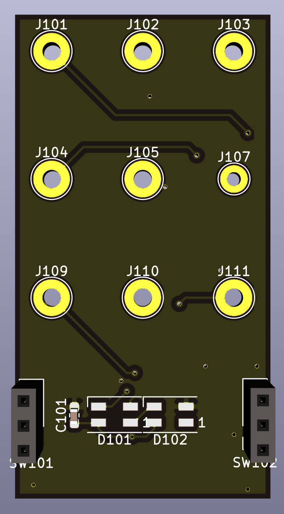
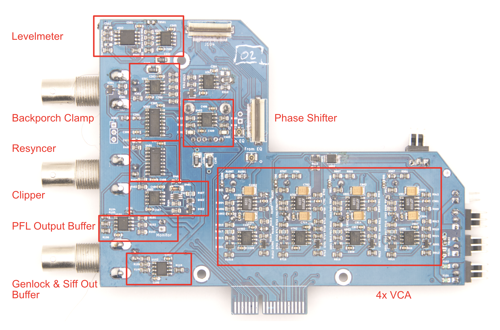
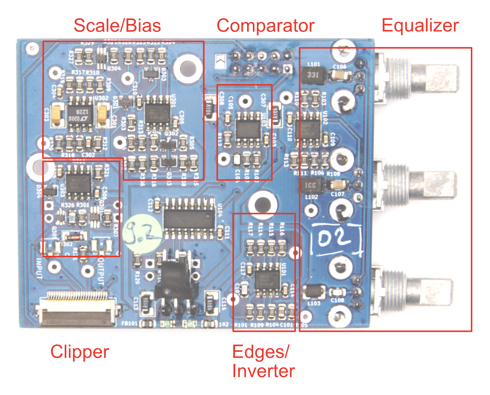
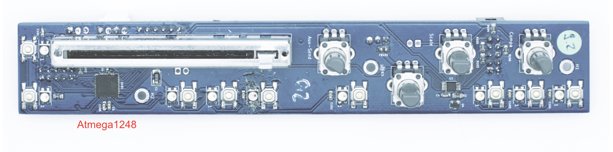

# Anymix 21 - Channel

##Signal Flow

Standard PAL composite video coming from the backside BNC input is first clamped to ground and then mixed to any signal present on the 2mm banana "SIFF" input. The result is fed to the vm113 effects board.

### vm113 effects
A bypassable bandpass highlights edges in the image. An optional comparator will separate the picture into black/white, the threshold is set by the digital to analog converter.
An optional inverter turns whites to blacks and blacks to whites, it also inverts colors.

The signal then passes a 3 band equaliser. This part is not digitally controlled, the potentiometers act on the actual analog signal.
Hi frequency is set around the color subcarrier frequency of 4.433 Mhz - removes or adds saturation.
Mid is around 15.6 kHz, the horizontal line frequency. Low is somwhere lower, we're still not very clear where, and where it should be ;-)

The scale and bias is again digitally controlled, so it can be automated or recorded in a preset.

Finally the signal can be clipped at 1V/0V separately.
Not clipping the low end will result in the signal erasing/pulling low other channels if it goes below GND - which can be very annoying but also very pleasant.

### Output stage
DAC2 controls the four voltage controlled amplifiers that send the signal to the mixing buses.

For previewing, the signal is clipped hard at 0/1V regardless of the clipper settings, then the resyncer cuts in sync tips and the colorburst coming from the genlock signal.
Colorburst is shifted to match the phase shift of the effects section.

The preview signal is fed to the LCD Monitor, as well as buffered and sent to the BNC preview out at the back of the mixer.

##PCBs

###vm102 inputs

vm102 just gathers all the signals from/to the 2mm banana jacks into a FFC cable.
It also hosts the two clip switches and neopixels for the levelmeter

###vm101 in-out

vm101 provides the backporch clamp for the BNC composite input and the mixer for the banana SIFF input. Preview out is resynched for the LCD monitor and the BNC PFL output.
4 voltage controlled amplifiers set the amount of signal that is sent on either mix bus.
Genlock signal from the mix bus is buffered and output through a third BNC connector.
An Attiny85 controls the levelmeter neopixels on vm102.
vm1010 connects to vm102 and vm113 through FFC cables.
SPI signals from vm010 to the DAC come through a 3pin header.

###vm113-effects

The different effect blocks are gathered around a MAX4053 analog switch that let's us bypass certain effects. An FFC cable connects to vm101 and the banana plugs on the frontpanel.
Control signals from vm010 come through a 10pin IDC.

###vm010-control

User input is sampled by the Atmega1248 at every vertical blanking interval. This microcontroiller has enough RAM to record and playback around 40 seconds of user interaction.
A MAX5741 generates the control voltages for the vm113 effects board. A second MAX5741 on vm101 is controlled through SPI. Communication with the master controller vm129 takes place through I2C over the 10pin IDC digital bus.