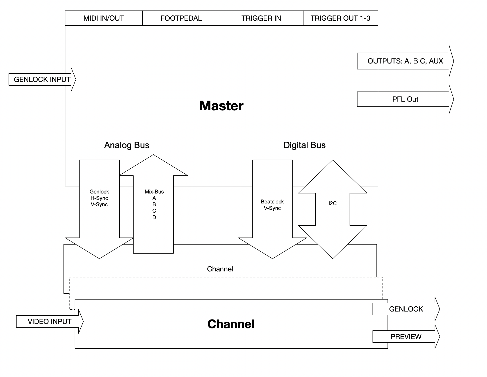

# Anymix 21 - Architecture

## Overview
The Anymix21 consists of one master module and 12 channel modules. Each module contains several separate PCBs that handle the signals. Two buses provide communcation between the master and all channels.

### Analog Bus
The analog bus runs near the back side of the mixer. It is a series of PCBs with card edge connectors where the channel modules can plug into. It carries the cleaned-up genlock signal from the master module, timing signals: horizontal sync, backporch/burst, and vertical sync. The channel's four output VCAs connect to the four mixing lines on the analog bus.

### Digital Bus
Digital signals run near the front side of the mixer through a 10 pin IDC ribbon cable. It provides communication from/to the ESP32 on the master module and the Atmega1284s on each channel module.

The master provides the v-sync pulse (most processing on the channel modules is done in the verical blanking interval), as well as the beat-clock / quantization signal used to synchronize channel automation to the bpm clock of the master module.

An i2c bus provides bi-directional communication between the master and channel modules.

### Power
Each channel draws about 400mA on 5V and a bit less on -5V supply rails. I tried to follow a star/tree like topology for power as much as possible. Each channel connects to the supply through it's own cable. The vm101 module on each channel has resettable fuses and large decoupling capacitors, and in turn supplies power to the different boards in the module.