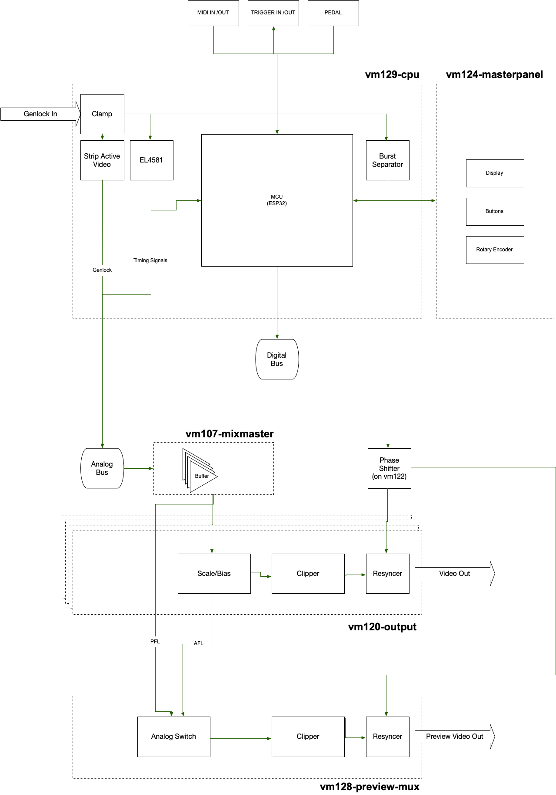

# Anymix 21 - Master

## Signal Flow
At the center of the master module is the vm129-cpu board. It handles Genlock input, timing and communication with all the channel modules. Signals on the mix bus are mixed and buffered by vm107. Each of the four outputs has its own vm120 board that sets the master level and does the clipping and resynching to construct a standard PAL video signal from the often quite wild signals coming from the mix bus.
A separate vm128 board gets all signals pre- and post-fader and can output one preview signal on the central LCD monitor as well as on the preview out BNC connector on the backside of the mixer.

To compensate for the phase shit of the mix signal due to the processing on the channel boards, the colorburst seperated from genlock can be freely shifted up to 180 degrees before being cut into the output signal.

## Synchronisation

There are two sync mechanisms running interlocked in parallel on the mixer: Beat Clock and Video Sync

### 1) Beat Clock: 
This clock ticks 24 times per beat, running either on an internal precision timer 
set to a specific BPM, or driven externally via MIDI realtime messages.
Trigger outputs and parameter automation runs in step with the beat clock, but quantized to vsync (see below)

Clock period varies between ~30ms @ 80bpm down to ~11ms @ 220bpm

### 2) Video Sync:
Vertical blanking interrupts taken from the Genlock signal (via the EL4581) are the main clock for all mixer operations. Most of digital communication and noisy behaviour (Neopixel updates, we're looking at you) take place during vertical blanking.
Clock period: fixed at 20ms

## Synkietext
Synkietext lets us embed information in the vertical blanking interval, much like has been done with Teletext. For the time being, the beat clock signal is inserted into line 22, so it can be recorded on tape and later be used to make synchronized obverdubs. But plans are to add the ability to embed digital information to subsequent lines, sort of like EXIF data in digital photography.

vm129 reads Synkietext from the Genlock signal. vm120 can insert Synkietext into the output signal.